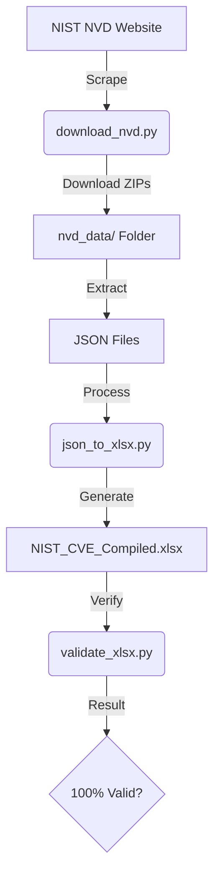

# 🛡️ NIST NVD CVE 2.0 to XLSX Converter

[](https://www.python.org/downloads/)
[](https://opensource.org/licenses/MIT)
[](https://nvd.nist.gov/vuln/data-feeds)

A robust, enterprise-grade toolkit for automating the download, extraction, and compilation of the entire NIST National Vulnerability Database (NVD) into a single, highly-structured Excel spreadsheet.

## ✨ Features

- 📥 **Automated Data Fetching**: Scrapes and downloads all CVE 2.0 JSON feeds (2002–Present).
- ⚡ **Smart Caching**: Skips re-downloading historical yearly archives to save bandwidth.
- 🔄 **Incremental Updates**: Always fetches the latest `modified` and `recent` vulnerability feeds.
- 📊 **Beautiful Excel Output**: Generates an indexed XLSX with annual sheets and a searchable master index.
- 🛡️ **Integrity Verification**: Built-in validation suite ensuring 100% data accuracy against source JSON.
- 🤖 **Automation Ready**: Designed for use in CI/CD pipelines and Power Automate workflows.

## 🏗️ Architecture



## 🚀 Quick Start

### 1. Installation

Clone the repository and install the dependencies:

```bash
pip install -r requirements.txt
```

### 2. Run the Full Pipeline

Execute the master orchestrator to handle the entire process automatically:

```bash
python run_pipeline.py
```

## 🛠️ Individual Components

If you need more control, you can run the components individually:

| Script | Purpose |
| :--- | :--- |
| `download_nvd.py` | Fetches and extracts the latest data feeds from NIST. |
| `json_to_xlsx.py` | Compiles the extracted JSON files into a structured Excel workbook. |
| `validate_xlsx.py` | Validates the final Excel file against the source JSON data. |

## 📅 Data Structure

The generated `NIST_CVE_Compiled.xlsx` includes:
- **INDEX Sheet**: A rapid-lookup summary of all CVEs (ID, Year, Severity, Score, Summary).
- **Annual Sheets (2002-2026)**: Detailed vulnerability data including descriptions, timestamps, and full CVSS vectors.

## 🤝 Contributing

Contributions are welcome! Please feel free to submit a Pull Request.

## 📜 License

This project is licensed under the MIT License - see the [LICENSE](LICENSE) file for details.

---
*Maintained with ❤️ for the Cybersecurity community.*
