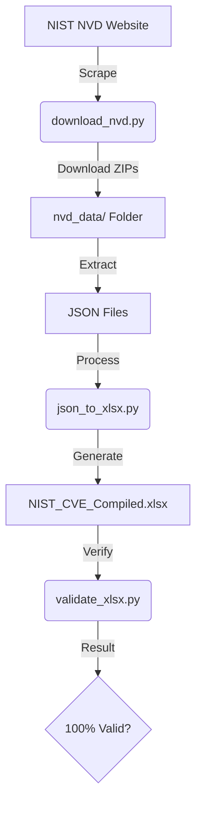

# NIST NVD CVE 2.0 to XLSX Converter

[](https://www.python.org/downloads/)
[](https://opensource.org/licenses/MIT)
[](https://nvd.nist.gov/vuln/data-feeds)

Toolkit for downloading NIST NVD CVE 2.0 JSON feeds and compiling them into a structured Excel workbook with annual sheets and a master index.

The supported development environment is Python 3.10 or newer. The current
CI matrix runs Python 3.12 so the verification toolchain receives security
updates promptly.

> **Spelling note:** The GitHub repository name keeps the historical `Convertor` / `XSLX` spellings. Preferred English spellings are **Converter** and **XLSX** (as used throughout this README and the scripts).

## Features

- **Automated data fetching**: Downloads CVE 2.0 JSON feeds (2002–present).
- **Smart caching**: Skips re-downloading historical yearly archives.
- **Incremental updates**: Always fetches the latest `modified` and `recent` feeds.
- **Excel output**: Indexed XLSX with annual sheets and a searchable master index.
- **Integrity verification**: Validates the workbook against source JSON.
- **Automation ready**: Suitable for CI/CD and scheduled runs.

## Architecture


```mermaid
graph TD
    A[NIST NVD Website] -->|Scrape| B(download_nvd.py)
    B -->|Download ZIPs| C[nvd_data/ Folder]
    C -->|Extract| D[JSON Files]
    D -->|Process| E(json_to_xlsx.py)
    E -->|Generate| F[NIST_CVE_Compiled.xlsx]
    F -->|Verify| G(validate_xlsx.py)
    G -->|Result| H{100% Valid?}
```

## Quick Start

```bash
# 1. Install runtime deps
pip install -r requirements.txt

# 2. Run the full pipeline (download → convert → validate)
#    Note: run_pipeline.py takes no CLI flags; it runs all three stages in order.
python run_pipeline.py
```

Output workbook: `NIST_CVE_Compiled.xlsx` in the project root.

### Optional: unit tests

```bash
pip install -r requirements-dev.txt
python -m pytest tests/ -q
```

## Individual Components

| Script | Purpose |
| :--- | :--- |
| `download_nvd.py` | Fetches and extracts the latest data feeds from NIST. |
| `json_to_xlsx.py` | Compiles extracted JSON files into a structured Excel workbook. |
| `validate_xlsx.py` | Validates the final Excel file against the source JSON data. |
| `run_pipeline.py` | Runs the three scripts above in sequence. |

Run a single stage the same way:

```bash
python download_nvd.py
python json_to_xlsx.py
python validate_xlsx.py
```

## Data Structure

The generated `NIST_CVE_Compiled.xlsx` includes:

- **INDEX sheet**: Rapid-lookup summary (ID, Year, Severity, Score, Summary).
- **Annual sheets (2002–present)**: Descriptions, timestamps, and CVSS vectors.

## Contributing

Contributions are welcome! Please feel free to submit a Pull Request.

## Verification

The CI gate installs the generated, hash-locked development requirements,
checks dependency consistency, compiles every pipeline entry point, and runs
the fixture-backed unit suite without downloading the NVD feed. Refresh the
lockfile only after reviewing dependency changes:

```bash
uv pip compile requirements-ci.in --python-version 3.12 --universal \
  --generate-hashes --output-file requirements-ci.txt
```

Run the same checks locally with:

```bash
python -m pip install --require-hashes -r requirements-ci.txt
python -m pip check
python -m pip_audit --progress-spinner off
python -m py_compile download_nvd.py json_to_xlsx.py validate_xlsx.py run_pipeline.py
python -m pytest tests/ -q
```

## License

This project is licensed under the MIT License — see the [LICENSE](LICENSE) file for details.

## Security

Report vulnerabilities privately using [SECURITY.md](SECURITY.md). Do not include NVD credentials, private fixtures, or sensitive scan data in public issues.

## Deployment

The converter is a local or controlled batch utility; CI verifies the package
without downloading the live NVD feed. Publish generated workbooks only to an
approved destination after reviewing the input snapshot and output contents.

## Troubleshooting

- Run `python -m pip check` when imports fail after an environment change.
- Use the fixture-backed tests to isolate parser or workbook regressions
  without depending on live NVD availability.
- Treat rate limits, network failures, and malformed feeds as operational
  inputs to diagnose rather than reasons to weaken validation.
